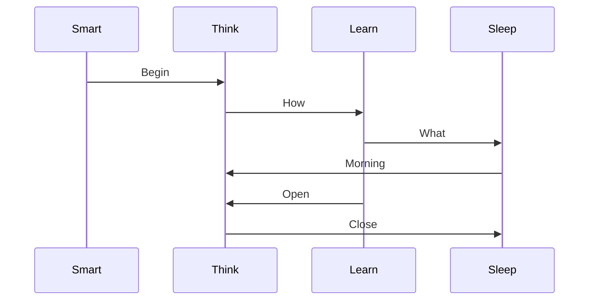
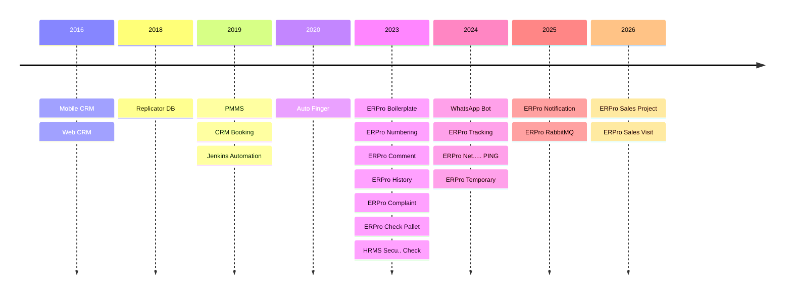

## @ Tukang Pecut Juru Ketik 👋

## Train
This diagram is How confusing my train of thought is

```mermaid
sequenceDiagram
    participant Smart
    participant Think
    participant Learn
    participant Sleep

    Smart->>Think: Begin
    Think->>Learn: How
    Learn->>Sleep: What
    Sleep->>Think: Morning
    Learn->>Think: Open
    Think->>Sleep: Close
```

## Project
This timeline is some of the projects that I have handled so far

```mermaid
timeline
    2016 : Mobile CRM
         : Web CRM
    2018 : Replicator DB
    2019 : PMMS
         : CRM Booking
         : Jenkins Automation
    2020 : Auto Finger
    2023 : ERPro Boilerplate
         : ERPro Numbering
         : ERPro Comment
         : ERPro History
         : ERPro Complaint
         : ERPro Check Pallet
         : HRMS Secu.. Check
    2024 : WhatsApp Bot
         : ERPro Tracking
         : ERPro Net..... PING
         : ERPro Temporary
    2025 : ERPro Notification
         : ERPro RabbitMQ
    2026 : ERPro Sales Project
         : ERPro Sales Visit
```
